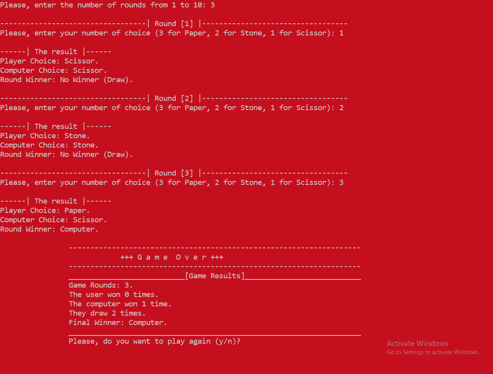

# Stone-Paper-Scissor Game in C++  

A console-based **Stone, Paper, Scissor** game written in C++. Play against the computer and see who wins the most rounds!  

## Features  
- Play multiple rounds (1 to 10).  
- Real-time round results with colored console output.  
- Sound effects for wins/losses.  
- Final game summary with scores.  

## How to Play 
1. Clone the repository:
```bash
git clone https://github.com/AbdulrahmanFrontend/stone-paper-scissor-cpp.git
```
2. Open in Visual Studio:
    - Double-click Bank-CLI-App.sln, OR
    - In VS: File → Open → Project/Solution → Select .sln file
3. Build & Run:
    - Press Ctrl + F5 (Run without debug) or F5 (Debug mode)

## Game Rules  
- **Stone** (2) crushes **Scissor** (1).  
- **Scissor** (1) cuts **Paper** (3).  
- **Paper** (3) covers **Stone** (2).  

## Screenshot  
  

## Contribution  
Feel free to fork and improve the game! Open a PR or submit issues.  